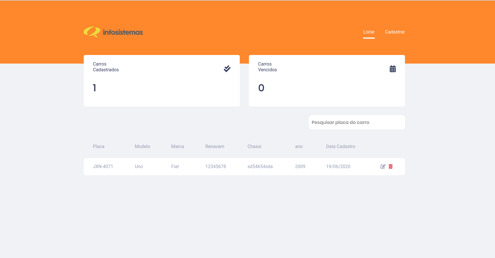
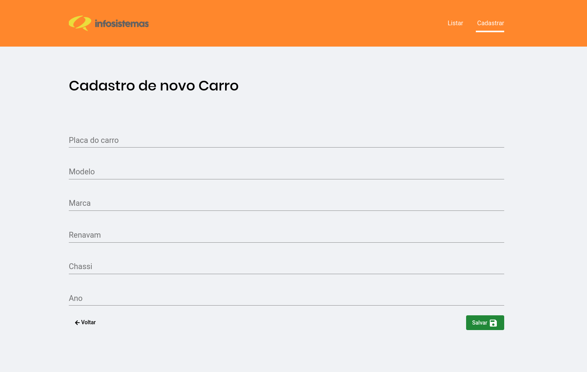
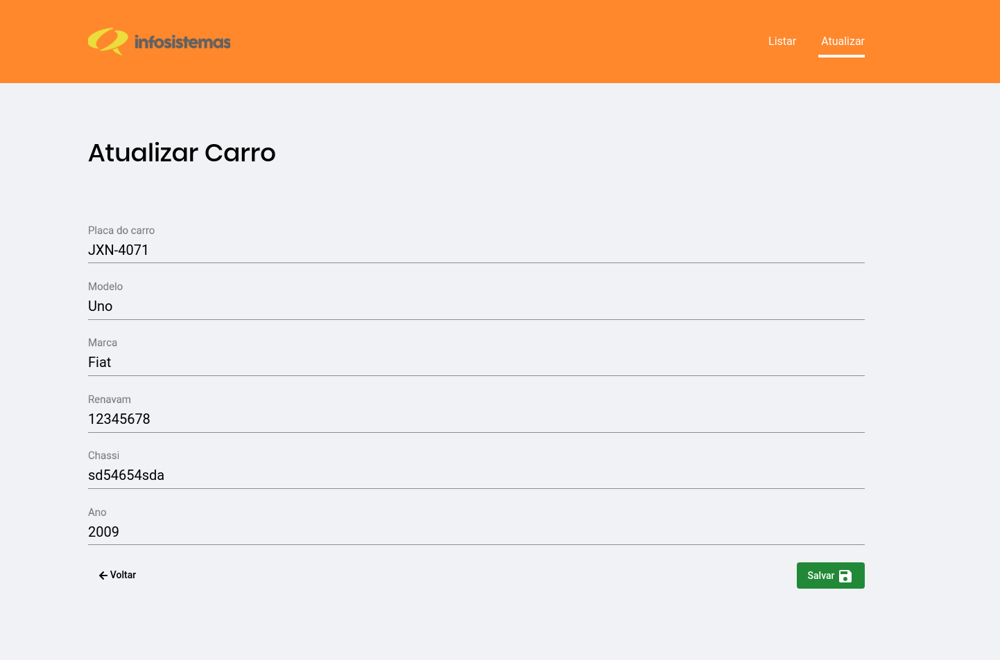

# Desafio-infosistemas
Sistema de Gestão para frotas

# Passos antes de executar
 1. yarn backend
 2. yarn typeorm migration:run
 3. yarn frontend

# Screenshot tela

* Tela principal

* Tela de cadastro

* Tela de update

